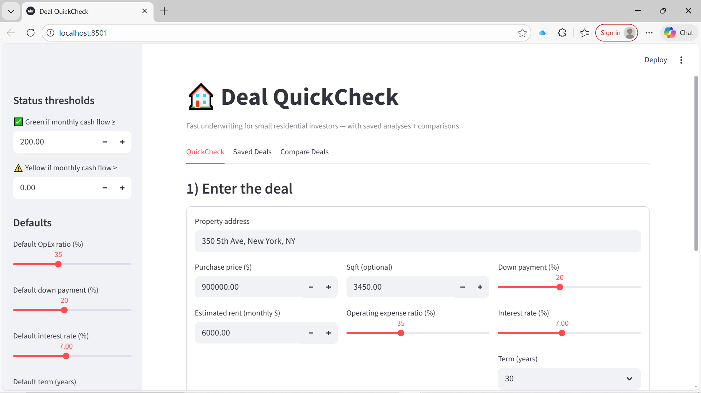
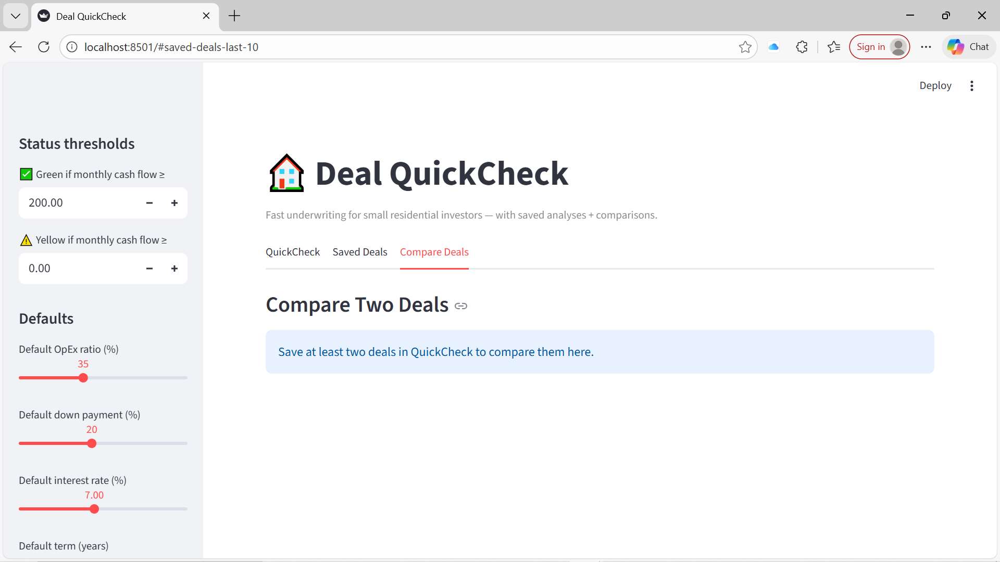

# Real Estate Deal QuickCheck

Live demo: https://real-estate-deal-analyzer.streamlit.app

A lightweight real estate underwriting tool built for small residential investors and Realtors to quickly decide whether a deal is worth pursuing.

## Key features
- Fast underwriting with sensible defaults (cash flow, cap rate, cash-on-cash)
- Save deal analyses for later review
- Compare two saved deals side-by-side
- Export a deal summary (CSV)

## Tech stack
Python • SQLite • Streamlit • Pandas

# Real Estate Deal QuickCheck

A lightweight real estate underwriting tool built for small residential investors and Realtors who need to quickly determine whether a deal is worth pursuing.

Deal QuickCheck allows users to input basic purchase, rent, and financing assumptions and instantly see key investment metrics such as monthly cash flow, cap rate, and cash-on-cash return. Each analysis can be saved and compared side-by-side to support faster, more confident decision-making.

### Who this is for
- Small buy-and-hold investors (1–10 units)
- Realtors evaluating deals for investor clients
- Anyone who wants a fast “first pass” on a potential deal

### What it does
- Runs fast, opinionated underwriting with sensible defaults
- Flags deals as **Worth a deeper look**, **Marginal**, or **Likely not worth pursuing**
- Saves deal analyses for later review
- Compares two deals side-by-side
- Exports deal summaries for sharing

### Built with
- Python
- SQL (SQLite)
- Streamlit

## Demo

The application includes a lightweight Streamlit UI that allows users to adjust
financing and operating assumptions and instantly see the impact on:

- Monthly cash flow
- Cash-on-cash return
- Cap rate

)

)
## Dashboard
Screenshots of the Streamlit UI showing QuickCheck, Saved Deals, and Compare views.

### QuickCheck

### Saved Deals

### Compare Deals

